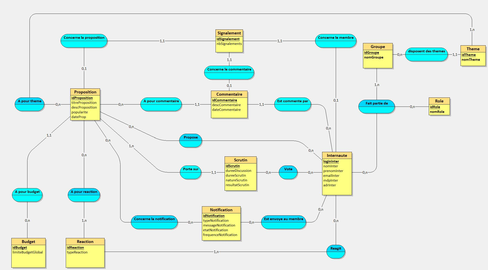
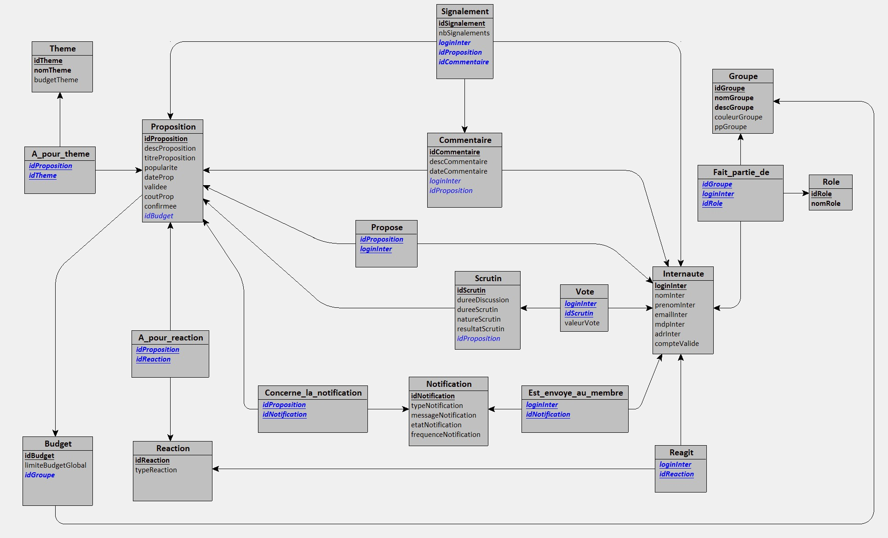

# S301-BD

## Scripts de création

- #### [Looping](./MEA-SR.txt)
- #### [MySQL](./creation.sql)

## [Script de population](./population.sql)

## TODO

### Remarques

- [x] La table Membre ne doit pas avoir d'attribut role
- [x] La table Membre est abigue (avec Internaute et par rapport au Role)
- [x] La table Internaute a un attribut idMembre ??
- [x] Cardinalite Proposition <-> Budget a revoir
- [x] Internaute devrait avoir un mot de passe (hash)
- [x] Proposition devrait avoir une date
- [x] Un membre ne peut faire qu'une proposition ?
- [ ] Ajouter une pp a la table groupe
- [ ] Un budget concerne un groupe (Budget -> #idGroupe -> Groupe)
- [ ] Ajouter un montant a Proposition (et Trigger qui checke le montant avec celui du budget)

### [Vues](./vues.sql)

- [x] Groupes d'un utilisateur
- [x] Propositions populaires
- [x] Propositions récentes
- [x] Propositions d'un utilisateur
- [x] Membres d'un groupe

### [Triggers](./triggers.sql)

- [ ] Réaction
  - [ ] Upvote : incrémenter popularité proposition concernée
  - [ ] Downvote : décrémenter popularité (peut être négative)
  - [ ] Suppression de la réaction : décrémenter / incrémenter popularité
- [ ] Proposition
  - [ ] Suppression de la proposition : supprimer tous les commentaires et réactions
- [ ] Vote
  - [ ] Double vote : empêcher un utilisateur de voter plusieurs fois dans le même scrutin

## Annexes

