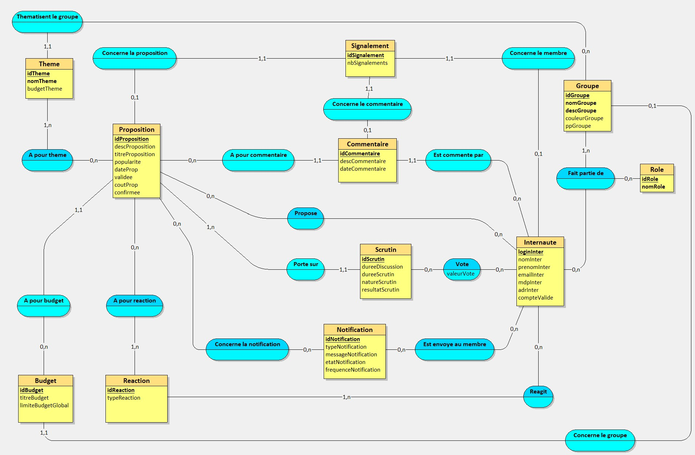
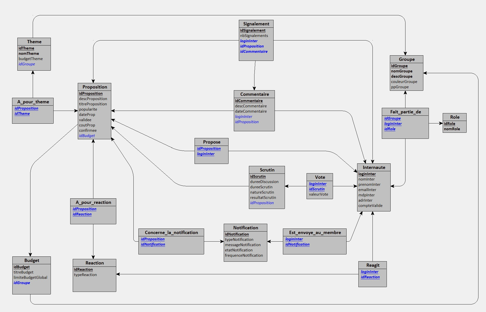

# S301-BD

## Scripts de création

- #### [Looping](./MEA-SR.txt)
- #### [MySQL](./creation.sql)

## [Script de population](./population.sql)

## TODO

### Remarques

- La table Membre ne doit pas avoir d'attribut role
- La table Membre est abigue (avec Internaute et par rapport au Role)
- La table Internaute a un attribut idMembre ??
- Cardinalite Proposition <-> Budget a revoir
- Internaute devrait avoir un mot de passe (hash)
- Proposition devrait avoir une date

### [Vues](./vues.sql)

- [ ] Groupes d'un utilisateur
- [ ] Propositions populaires
- [ ] Propositions récentes
- [ ] Propositions d'un utilisateur
- [ ] Membres d'un groupe

### [Triggers](./triggers.sql)

- [ ] Réaction
  - [ ] Upvote : incrémenter popularité proposition concernée
  - [ ] Downvote : décrémenter popularité (peut être négative)
  - [ ] Suppression de la réaction : décrémenter / incrémenter popularité
- [ ] Proposition
  - [ ] Suppression de la proposition : supprimer tous les commentaires et réactions
- [ ] Vote
  - [ ] Double vote : empêcher un utilisateur de voter plusieurs fois dans le même scrutin

## Annexes

